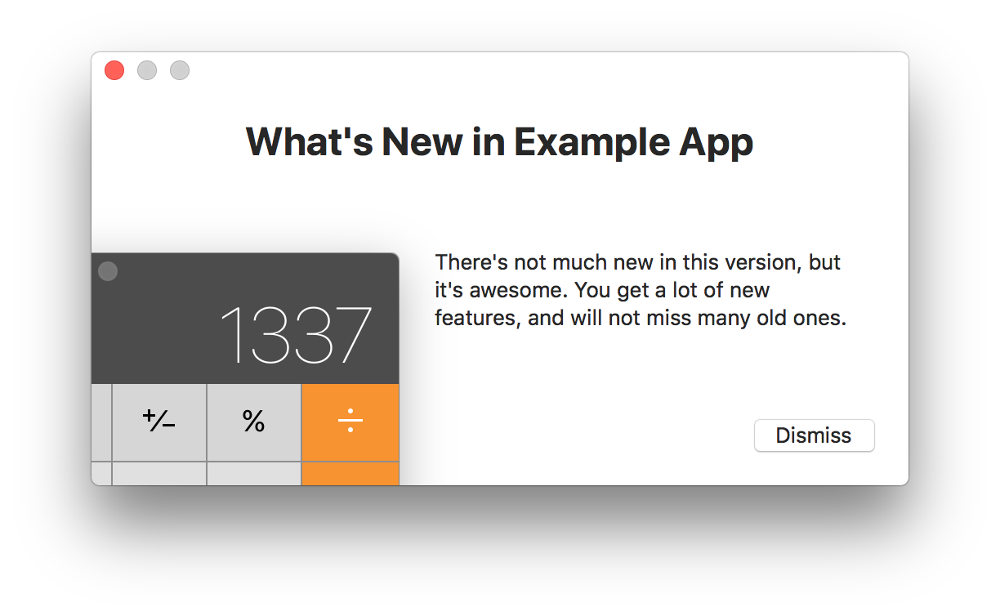

# WhatsNewKit


[](https://github.com/Carthage/Carthage)

A convenient model to talk about `Update`s and `Version`s, a window controller to display your update notices in, and `UserDefaults` extensions so the user only sees the notices when she needs to.

## Overview 

<div align="center">
    
</div>

You tell `WhatsNew` about the current settings and then let it figure out if it needs to display the "What's New" update window or not.

```swift
func applicationDidFinishLaunching(_ aNotification: Notification) {
    // Figures out settings & app version from UserDefaults.standard 
    // and Bundle.main:
    let whatsNew = WhatsNew(configuration: .standardMain)
    
    // Set up information about the latest "What's New"-worthy version:
    let update = Update(version: Version(2, 2, 0), view: aViewWithAllInfos)
    
    // Show the update notice if the criteria match and store 
    // the version information in UserDefaults.standard for the next run.
    whatsNew.displayIfNeededAndRegister(update: update)
}
```

### Behavior

The main intention of WhatsNewKit is to display update information to existing users.

1. Upon first launch of your app, WhatsNewKit is supposed to _not_ display a "What's New" window. 
2. Existing users will only get _new_ update notices exactly _once_.

### Set Up Details

There's not much you need to know that Xcode's code completion won't tell you, but here's a description anyway.

You can create **`WhatsNew.Configuration`** in 3 ways:

- Manually, e.g. for testing or when you want to obtain the information from a different source: `.init(isFirstLaunch:appVersion:lastWhatsNewVersion:)`
- Reading values from `UserDefaults` and `Bundle`:  `.init(userDefaults:appBundle:)`
- Reading values from the main bundle and standard user defaults: `.standardMain`

To set up **the current `Update`,** you use `Update.init(version:windowTitle:view:)`. The parameter `windowTitle` is optional. You can use any view, as long as it descends from `UpdateView` (mostly for upcoming feature compatibility). That view will be used as the `NSWindow.contentView` touching all window edges, so you can design it the way you like. 

Armed with a `Configuration` and `Update` instance, you can create a `WhatsNew` instance and make it `displayIfNeededAndRegister(update:)`.

### Displaying the Update Notice

You can use `WhatsNew.display(update:)` to show the latest version information. This could be used in a menu bar item, for example.

Use `WhatsNew.displayIfNeeded(update:)` to let WhatsNewKit figure out if the user needs to see the update info.

## License

Copyright (c) 2018 Christian Tietze. Distributed under the MIT License.
