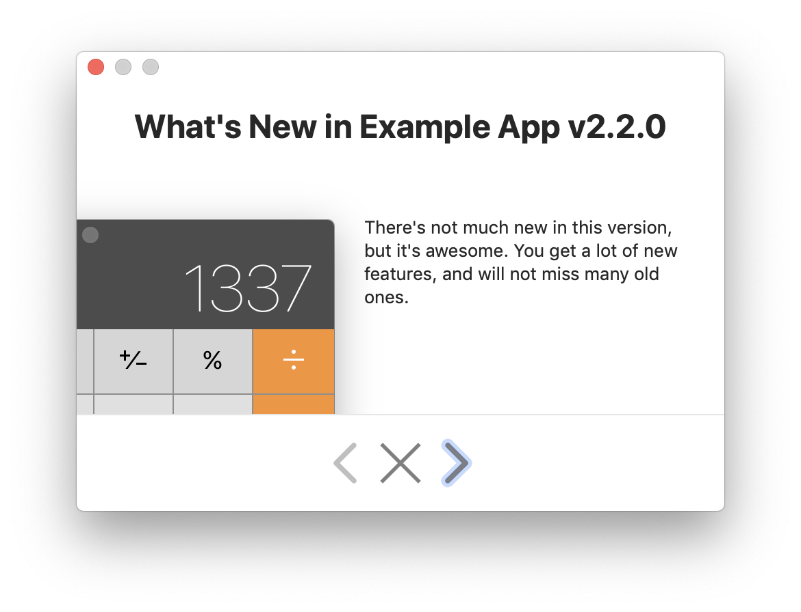

# WhatsNewKit


[](https://github.com/Carthage/Carthage)

What's in here?

- A convenient model to talk about `Update`s and `Version`s, 
- a UI to display your update notices in, 
- and `UserDefaults` extensions so the user only sees the messages when she needs to.

## Overview 

<div align="center">
    
</div>

You tell `WhatsNew` about the current settings and then let it figure out if it needs to display the "What's New" update window or not.

```swift
func applicationDidFinishLaunching(_ aNotification: Notification) {
    // Figures out settings & app version from UserDefaults.standard 
    // and Bundle.main:
    let whatsNew = WhatsNew(configuration: .standardMain)
    
    // Set up information about the latest "What's New"-worthy version:
    let update = Update(version: Version(2, 2, 0), view: aViewWithAllInfos)
    
    // Show the update notice if the criteria match and store 
    // the version information in UserDefaults.standard for the next run.
    whatsNew.displayIfNeededAndRegister(update: update)
}
```

## How to Use

### Behavior

The main intention of WhatsNewKit is to display update information to existing users.

1. Upon first launch of your app, WhatsNewKit is supposed to _not_ display a "What's New" window. 
2. Existing users will only get _new_ update notices exactly _once_.

This works with 1 or multiple updates that have been missed.

### Set Up Details

There's not much you need to know that Xcode's code completion won't tell you, but here's a description anyway.

You can create **`WhatsNew.Configuration`** in 3 ways:

- Manually, e.g. for testing or when you want to obtain the information from a different source: `.init(isFirstLaunch:appVersion:lastWhatsNewVersion:)`
- Reading values from `UserDefaults` and `Bundle`:  `.init(userDefaults:appBundle:)`
- Reading values from the main bundle and standard user defaults: `.standardMain`

To create an `Update`, you use one of its designated initializers:

- `Update.init(version:windowTitle:view:)` to pass it any `NSView` directly, or
- `Update.init(version:windowTitle:viewContainer:)` to pass it a `ViewContainer`-conforming object, like a `NSViewController` you get from a Nib. (See below for Nib details.)

The parameter `windowTitle` is optional in all of these. 

The resulting view will be displayed in the content section of the `NSWindow` of this framework

Armed with a `Configuration` and `Update` instances, you can create a `WhatsNew` instance and make it `displayIfNeededAndRegister(updates:)`.

> **⚠️ Heads Up with the View Design ⚠️** Your views need to be laid-out very strict so that inserting them into the window using Auto Layout affects the window size appropriately. If your size or position constraints have a priority of `NSLayoutPriorityWindowSizeStayPut`, which is known to be `500`, then the window will not size to fit the content. I found multi-line labels to be especially cumbersome and recommend you set an explicit size if you can.  

### How to Create Your View

You can pass any `NSView` subclass to `Update.init(version:windowTitle:view:)`, no matter if it's loaded from a Storyboard, Nib, or created in code.

Nibs work especially well! 🎉

Look at the example app in this project for inspiration. 

The trick is this:

1. Create a  `UpdateViewFromNib` wrapper: It loads a `NSViewController` from a Nib and obtains its main view.
    - `UpdateViewFromNib.init(nibName:bundle:)` behaves like the `NSViewController` initializer. 
    - `UpdateViewFromNib.init(version:bundle:)` assumes the Nib file is called `WhatsNew_vX_Y_Z`, where X, Y, and Z are the major, minor, and patch version component of your `Version` object respectively. (`Version(1,8,0)` resolves to `WhatsNew_v1_8_0.xib`.)
2. Use the variant `Update.init(version:windowTitle:viewContainer:)` to pass the `UpdateViewFromNib` object in as the `viewContainer` directly for your convenience.

### Displaying the Update Notice

You can offer your app users an affordance, e.g. a menu item, to display what's new regardless of the setting.

- Use `WhatsNew.display(update:)` to show exactly one version information.
- Use `WhatsNew.display(updates:)` (note the plural!) to show multiple version informations.

Use `WhatsNew.displayIfNeeded(update:)` or `WhatsNew.displayIfNeeded(updates:) `to let WhatsNewKit figure out if the user needs to see any update info.

## License

Copyright (c) 2019--2020 Christian Tietze. Distributed under the MIT License.
